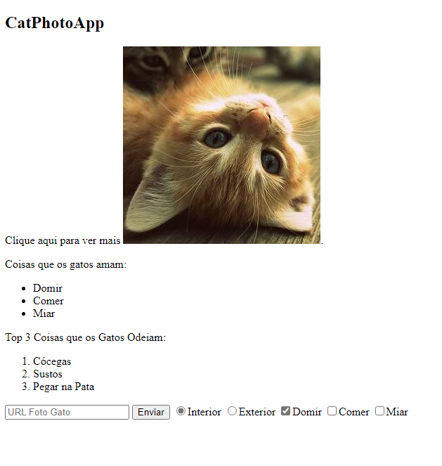

<h1>FreeCodeCamp</h1>
<h2>HTML e HTML5 básicos</h2>

HTML é uma linguagem de marcação que usa uma sintaxe ou notação especial para descrever a estrutura de uma página da Web para o navegador. Os elementos HTML geralmente têm tags de abertura e fechamento que os circundam e dão significado ao conteúdo. Elementos diferentes, por exemplo, podem descrever o texto como um título, um parágrafo ou item da lista.

 
 

Neste curso, você vai construir um aplicativo de fotografia de gatos para aprender alguns dos elementos HTML mais comuns: os blocos de construção de qualquer página da web.

<strong>Página Web final do módulo:</strong> <a href="https://edijunior88.github.io/FreeCodeCamp_HTML_e_HTML5_basico/">https://edijunior88.github.io/FreeCodeCamp_HTML_e_HTML5_basico/</a>

<ul>
  <li>Conhecer os elementos HTML</li>
  <li>Criar títulos com o elemento h2</li>
  <li>Informar com o elemento de parágrafo</li>
  <li>Preencher um espaço vazio com um texto placeholder</li>
  <li>Remover comentário no HTML</li>
  <li>Comentar em HTML</li>
  <li>Excluir elementos HTML</li>
  <li>Conhecer os primeiros elementos do HTML5</li>
  <li>Adicionar imagens ao seu site</li>
  <li>Criar links para páginas externas com elementos de âncora</li>
  <li>Criar links para seções internas de uma página com elementos de âncora</li>
  <li>Inserir um elemento de âncora em um parágrafo</li>
  <li>Tornar links inativos usando o símbolo de hash</li>
  <li>Transformar uma imagem em um link</li>
  <li>Criar uma lista não ordenada de itens</li>
  <li>Criar uma lista ordenada</li>
  <li>Criar um campo de texto</li>
  <li>Adicionar texto placeholder a um campo de texto</li>
  <li>Criar um elemento de formulário</li>
  <li>Adicionar um botão de envio a um formulário</li>
  <li>Tornar um campo de entrada obrigatório usando HTML5</li>
  <li>Criar um grupo de botões de seleção</li>
  <li>Criar um grupo de caixas de seleção</li>
  <li>Usar o atributo value nos inputs do tipo radio e checkbox</li>
  <li>Marcar botões e caixas de seleção por padrão</li>
  <li>Inserir diversos elementos em um único elemento div</li>
  <li>Declarar o doctype de um documento HTML</li>
  <li>Definir head e body de um documento HTML</li>
 </ul>

<h4><b>Curso:</b> :green_book: :books: 28 capítulos</h4>
<h4><b>Status do Curso:</b> :speech_balloon: Estudando</h4>
